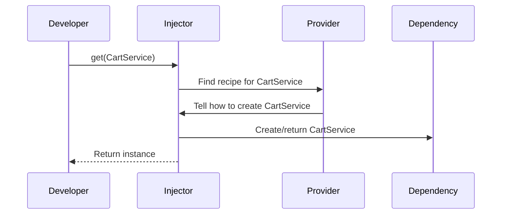

# Chapter 1: Provider

Welcome to your journey with `simple-ts-di`! In this first chapter, we'll explore the foundation of how dependencies are managed: **Providers**.

---

## Why Do We Need Providers?

Imagine you're building a simple online store app. Many parts of your app need access to a `CartService` – for example, your shopping cart view, your checkout button, and your order summary. Home-baking a new copy everywhere would be wasteful and error-prone. 

Wouldn’t it be great if you had a **menu** that told your app’s engine *how* and *what* kind of `CartService` you want to use, and your app would simply ask for "the CartService", getting just what you configured? 

**Providers** make this possible!

---

## What is a Provider?

A **Provider** is a set of instructions that tells the dependency system:

- *What* you want (`CartService`, a value, a function, etc.)
- *How* to create or supply it (using a class, value, existing thing, or even a custom factory function!)

You can think of Providers like a menu in a restaurant:

- "When asked for `Coffee`, use this special recipe."  
- "When asked for `Tea`, just give this value."
- "When asked for `Juice`, use whatever is already registered as `FruitPunch`."

---

## Common Types of Providers

Let's break them down into easy-to-understand types, with starter code examples.

### 1. Value Provider

**Supplies a fixed value** for a dependency. Imagine always returning the same sugar cube for every tea order!

```ts
import { InjectionToken } from 'simple-ts-di';

const APP_TITLE = new InjectionToken<string>('AppTitle');

const titleProvider = {
  provide: APP_TITLE,
  useValue: 'My Cool Shop'
};
```

**Explanation:**  
When the app asks for `APP_TITLE`, it always receives `'My Cool Shop'`.

---

### 2. Class Provider

**Creates a fresh instance** of a class each time it's needed.

```ts
class CartService {
  // Cart logic...
}

const cartProvider = {
  provide: CartService,
  useClass: CartService
};
```

**Explanation:**  
Every time the app asks for `CartService`, a new instance of `CartService` will be created.

---

### 3. Existing Provider

**Redirects requests** for one dependency to another. Like saying “Order `Coffee`, but really, just serve `Espresso`.”

```ts
const cartAliasProvider = {
  provide: 'ShoppingBasket',
  useExisting: CartService
};
```

**Explanation:**  
If someone asks for `'ShoppingBasket'`, they'll actually get `CartService`.

---

### 4. Factory Provider

**Uses a custom factory function** to produce the value.

```ts
const randomIdProvider = {
  provide: 'RandomID',
  useFactory: () => Math.random().toString(36).substring(2)
};
```

**Explanation:**  
Each time `'RandomID'` is requested, a new random string is delivered.

---

## Using Providers in the Dependency System

### Registering Providers

Let's see how you can use these providers when setting up the `Injector` (the part that stores and dishes out your dependencies):

```ts
import { Injector } from 'simple-ts-di';

const injector = new Injector(null, [
  titleProvider,
  cartProvider,
  cartAliasProvider,
  randomIdProvider
]);
```

Now, whenever you ask the `injector` for a dependency, it will use these recipes!

---

### Getting a Value from a Provider

```ts
const title = injector.get(APP_TITLE);
// title === 'My Cool Shop'
```
**Explanation:** The `injector` looks up the provider for `APP_TITLE` and gives you its value.

---

## Under the Hood: How Providers Work

Let's peek into how the system uses your provided menu. We'll focus on the journey when you ask for a dependency.

### Sequence of Events



**Here's what happens, step by step:**
1. **You ask** for a dependency (e.g., `CartService`).
2. The **Injector** looks up the registered provider for it.
3. It reads the provider's "recipe” (`useClass`, `useValue`, etc.).
4. It creates or returns the correct item as instructed.
5. You get back the instance or value you requested!

---

### How is This Coded? (A Gentle Peek)

When you call:

```ts
injector.get(CartService);
```

The Injector finds the right provider in its list and follows its instructions. Here’s a simplified version from `src/di/injector/injector.ts` ([code reference]):

```ts
public get<T>(token): T {
  // 1. Look up the provider (recipe) for the given token.
  provider = this.providers.get(token.name);
  
  // 2. If the provider uses a value...
  if ('useValue' in provider) {
    return provider.useValue;
  }
  // 3. If the provider uses a class...
  if ('useClass' in provider) {
    return new provider.useClass();
  }
  // ...and so on!
}
```

**Explanation:**  
The Injector checks the provider type and knows *how* to get what you asked for.

---

## Provider Definitions

Providers are defined using interfaces and types in `src/di/types/provider.ts` ([code reference]):

```ts
export interface ValueProvider<T> {
  provide: InjectionToken<T> | Constructor<T>
  useValue: T
}

// Similarly for ClassProvider, ExistingProvider, FactoryProvider...
```

**Explanation:**  
These definitions simply standardize the "recipes" so the Injector knows what to look for!

---

## Analogies & Recap

You can imagine Providers as:

- **Recipes in a kitchen** (for preparing food exactly how you want!)
- **Menu entries** (that tell the chef what and how to prepare)
- **Mail forwarding instructions** (send "ShoppingBasket" mail to "CartService" address)

---

## Conclusion

Providers are the *menu* that powers dependency injection in `simple-ts-di`. You learned:

- Why providers are needed
- Different provider types (value, class, existing, factory)
- How the Injector uses providers to get what you need

In the next chapter, you'll see how to use the abstraction that lets you refer to anything as a dependency, even *before* it exists: the [InjectionToken](02_injectiontoken_.md)!

---

Ready to master dependency lookup? Continue to [Chapter 2: InjectionToken](02_injectiontoken_.md)!

---

Generated by [AI Codebase Knowledge Builder](https://github.com/The-Pocket/Tutorial-Codebase-Knowledge)