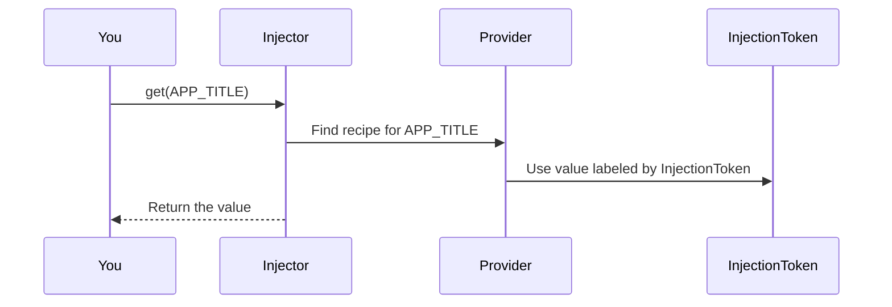

# Chapter 2: InjectionToken

Welcome back! In [Chapter 1: Provider](01_provider_.md), you learned how **providers** give instructions to the dependency system about what to deliver and how.

But... what if you want to refer to **something that doesn’t even have a class or value yet**—like a configuration, or an interface, or even just a constant? That’s where `InjectionToken` comes in!

---

## Why Do We Need InjectionTokens?

Let's start with a real-life scenario:

**Imagine:**  
You want different parts of your app to know the store’s name ("SuperMart")—like for displaying in the title bar, or in emails. But you don’t want them tied to a `StoreTitleService` class, or even to know exactly *where* the value comes from.

You might just want to say:  
*“Hey, give me the thing I labeled as ‘StoreTitle’ – I don’t care what it actually is under the hood.”*

This is exactly what **InjectionTokens** are for!

---

## What Exactly is an InjectionToken?

Think of an InjectionToken as a **special label or a name tag** that you put on a box.  
Whoever needs what’s inside the box asks for it by the label, not by what’s inside. If what’s inside changes, everyone can keep asking for the same label and get the new thing, without knowing the details.

### When Would You Use an InjectionToken?

- **When you want to provide a value for an interface or type** (Typescript loses type info at runtime!)
- **When you want to inject strings, numbers, or constants** (not just classes)
- **When you want to fully decouple the provider from its consumers**

---

## Example: Injecting a Simple Configuration Value

Let’s say you want to provide your Application’s title, **but not using a class**.

### 1. Create the InjectionToken

```ts
import { InjectionToken } from 'simple-ts-di';

export const APP_TITLE = new InjectionToken<string>('AppTitle');
```

**Explanation:**  
- `APP_TITLE` is NOT a string (even though `AppTitle` is its label).  
- It’s a **token object** that uniquely identifies your app title wherever you use it.

---

### 2. Provide a Value for Your Token

```ts
import { APP_TITLE } from './app-tokens';

const titleProvider = {
  provide: APP_TITLE,
  useValue: 'SuperMart'
};
```

**Explanation:**  
You’re telling your DI system: "When someone asks for `APP_TITLE`, they get `'SuperMart'`."

---

### 3. Use the Token to Fetch the Value

```ts
import { Injector } from 'simple-ts-di';
import { APP_TITLE } from './app-tokens';

const injector = new Injector(null, [titleProvider]);

const title = injector.get(APP_TITLE);
// title === 'SuperMart'
```

**Explanation:**  
Regardless of what’s going on inside, you just use `APP_TITLE` (the **token/label**) to ask for your value.

---

## Solution: Solving the Use Case

> **Need to inject something with no class? Use an InjectionToken!**

**Tokens are useful for:**  
- Injecting settings or config
- Injecting interfaces (like logs, storage, theme, etc.)
- Providing alternative implementations without changing consumers

**For Example:**  
Let’s say you want to switch the app title at runtime. Just change the value for `APP_TITLE`—no code elsewhere needs to care!

---

## Key Idea: Tokens Are Safer Than Strings

- **Strings are not unique!** Someone might register two values with label `"AppTitle"` by accident.
- **InjectionToken** objects are **unique** (even if their names are the same), so you’ll never get cross-wires.

---

## Internal Implementation: How Does InjectionToken Work?

Let’s see **what happens under the hood** when you use an InjectionToken in your dependency system.

### Step-by-Step: What Happens When You Use an InjectionToken?



- **You** ask the Injector for `APP_TITLE`.
- The **Injector** looks through its list for an exact match with your token.
- The **Provider** returns the value using the InjectionToken as the key.
- The Injector delivers what you asked for—independent of what’s inside.

---

### Under the Hood: The InjectionToken Code

**File:** `src\di\injection-token.ts`

```ts
export class InjectionToken<T = any> {
  constructor(
    public readonly name: string,
    public readonly options?
  ) {
    // If providedIn: 'root', auto-register with the root injector
    if (options?.providedIn === 'root') {
      ROOT_INJECTOR.provide({
        provide: this,
        useFactory: options.useFactory,
        deps: options.deps,
      })
    }
  }
}
```

**Explanation:**  
- `InjectionToken` creates **an object with a unique identity** (it’s not just a string!).
- Optionally, you can specify a factory and dependencies for more advanced scenarios (ignore this for now as a beginner).
- If you want it auto-registered at app-start, pass `providedIn: 'root'`.

---

### How Does the Injector Lookup Providers?

**File:** `src\di\types\provider.ts`

```ts
export interface ValueProvider<T> {
  provide: InjectionToken<T> | Constructor<T>
  useValue: T
}
```

**Explanation:**  
- The `provide` can be a class **or** a token—your Injector recognizes both.
- You can use tokens as keys everywhere you’d use a class reference.

---

## Visual Summary

```mermaid
flowchart LR
  subgraph Store Values [Injector/Container]
    APP_TITLE["APP_TITLE token"]-->|'SuperMart'| Value
    CART_SERVICE --|instance| ServiceInstance
  end

  View-->|requests| APP_TITLE
  APP_TITLE-->|returns| Value
```

- Anyone with the `APP_TITLE` InjectionToken can retrieve the current value—**without caring how it's stored!**

---

## Analogies

- **Post Office Box**: You don’t care who’s inside P.O. Box 123, you just use the key!
- **Radio Station Dial**: Tune to 98.2 FM and get whatever is being broadcast, regardless of the station's actual programming.

---

## Recap: What Have You Learned?

- **InjectionToken** lets you refer to dependencies by label—not by implementation.
- This unlocks safe, flexible, decoupled injection of values, configs, and interfaces.
- Tokens are **unique**—even if two tokens share the same string label, they’re never confused.

---

Ready to see how to make your **classes** injectable?  
Let's move on to [@Injectable Decorator](03__injectable_decorator_.md) and see how it works!

---

Continue your journey: [Chapter 3: @Injectable Decorator](03__injectable_decorator_.md)


---

Generated by [AI Codebase Knowledge Builder](https://github.com/The-Pocket/Tutorial-Codebase-Knowledge)