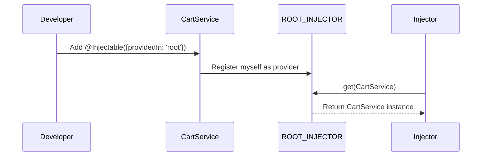

# Chapter 3: @Injectable Decorator

Welcome back! In [Chapter 2: InjectionToken](02_injectiontoken_.md), you learned how **InjectionTokens** let you safely and uniquely refer to any kind of value or interface in your dependency system—even if that value isn't a class.

But what if you want to make a *class* discoverable for dependency injection? Maybe you have a `CartService` or a `PaymentGateway` you want other parts of your app to easily use.

That’s where the `@Injectable` decorator comes in!

---

## Why Do We Need `@Injectable`?

Imagine you’re building a shopping app, and you create a reusable `CartService` to manage the shopping cart. You want **many parts** of your app (product pages, checkout, header, etc.) to be able to get and share the *same instance* without having to manually create it everywhere.

**Goal:**  
Make your `CartService` available to the app’s dependency injection system with *one line*—so others can just “ask” for it using DI.

**Without `@Injectable`:**
- You’d have to wire up providers by hand for every injectable class.
- More boilerplate, more chance for mistakes!

**With `@Injectable`:**
- One simple decorator auto-registers your service for injection, anywhere you need it.

---

## What is the `@Injectable` Decorator?

The `@Injectable` decorator:

- Tags a **class** as available for dependency injection.
- Optionally says **where it should be provided** (like the main/root warehouse, so the class is available app-wide).
- Automatically registers it for you—no manual provider setup needed!

**Analogy:**  
It’s like putting a big “Add me to the global recipe book!” sticker on your class, so the DI kitchen always knows how to make (or share) it.

---

## Step-by-Step: Making Your Service Injectable

Let’s walk through how to use `@Injectable` in a real example.

### 1. Create a Simple Service

```ts
export class CartService {
  addItem(item: string) {
    // ...add item logic
  }
}
```

Currently, this class is **not** known to the dependency system.

---

### 2. Decorate the Class with `@Injectable`

```ts
import { Injectable } from 'simple-ts-di';

@Injectable({ providedIn: 'root' })
export class CartService {
  addItem(item: string) {
    // ...add item logic
  }
}
```

- `@Injectable({ providedIn: 'root' })` registers `CartService` in the main warehouse (the “root injector”).
- Now, every part of your app can inject and use `CartService`—no extra setup needed.

---

### 3. Using Your Injectable Service

Now, anyone can get an instance of `CartService` from the injector:

```ts
import { Injector } from 'simple-ts-di';
import { CartService } from './cart.service';

const injector = new Injector();

const cart = injector.get(CartService);

cart.addItem('Apple');
```

**What happens here?**
- The `injector` sees that `CartService` is decorated as injectable and registered in the root warehouse.
- It returns *the shared `CartService` instance* automatically!

---

## Key Idea: Auto-Registration (“Available to All Kitchens”)

Setting `providedIn: 'root'` makes your class **auto-register** with the main injector. This means your class is available globally—no need to manually list providers for it.

**If you skip `providedIn: 'root'`,** the decorator just marks the class as injectable, but you must register it manually with an injector.

---

## Visual Concept: How `@Injectable` Works

```mermaid
flowchart LR
    A[CartService<br>(decorated with Injectable)] -- registers --> B[ROOT_INJECTOR<br>(Main Warehouse)]
    C[CheckoutPage] -- asks for CartService --> B
    D[ProductPage] -- asks for CartService --> B
    B -- returns same instance --> C
    B -- returns same instance --> D
```

- `CartService` is registered with the “main warehouse”.
- Any page or feature can ask for it by type and get the same instance, automatically!

---

## Under the Hood: How Does `@Injectable` Work?

Let’s look at what happens in simple steps when you apply `@Injectable`.

### What Happens, Step by Step?



1. **You decorate** your service class with `@Injectable({ providedIn: 'root' })`.
2. When the app loads, `CartService` **registers itself** in the root injector.
3. When you ask the Injector for `CartService`, it knows how to build or find it.

---

### Minimal Internal Code (Behind the Scenes)

Let’s peek at the real `@Injectable` implementation (simplified):

**File:** `src/di/decorators/injectable.ts`

```ts
export function Injectable(props = {}) {
  // This function is called when the class is defined!
  return function (target) {
    if (props.providedIn === 'root') {
      // Auto-register with the root injector
      ROOT_INJECTOR.provide(target);
    }
    return target;
  }
}
```

- When you write `@Injectable({ providedIn: 'root' })`, your class is *immediately* registered in the root injector.
- The injector now knows how to provide an instance anywhere in your app.

**Explained:**  
- The decorator wraps your class and, if you use `providedIn: 'root'`, calls `ROOT_INJECTOR.provide(...)` to add it to the main provider list.
- No need for manual registration!

---

## Recap and Analogy

**Analogy:**  
Think of your app as a big building, and the root injector as the central kitchen pantry. Adding `@Injectable({ providedIn: 'root' })` is like giving the chef a new recipe that’s available everywhere, instantly.

- Classes decorated with `@Injectable` can be injected throughout your app with zero extra config.
- If you use `providedIn: 'root'`, they’re auto-registered and ready for use anywhere.

---

## Conclusion

Thanks to the `@Injectable` decorator, you can easily make any class available to the dependency injection system—no boilerplate, no manual provider setup. You now know how to:

- Mark classes as injectable ingredients in your DI system
- Instantly register them to the main injector with `providedIn: 'root'`
- Unlock simple, automatic sharing of class instances throughout your app

**Next, you’ll discover how the "waiter" works: the [Injector](04_injector_.md)—the piece responsible for handing out dependencies when you ask.**

Continue your journey: [Chapter 4: Injector](04_injector_.md)

---

Generated by [AI Codebase Knowledge Builder](https://github.com/The-Pocket/Tutorial-Codebase-Knowledge)