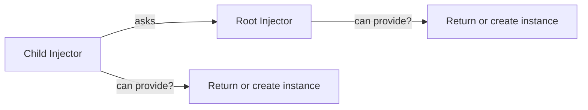
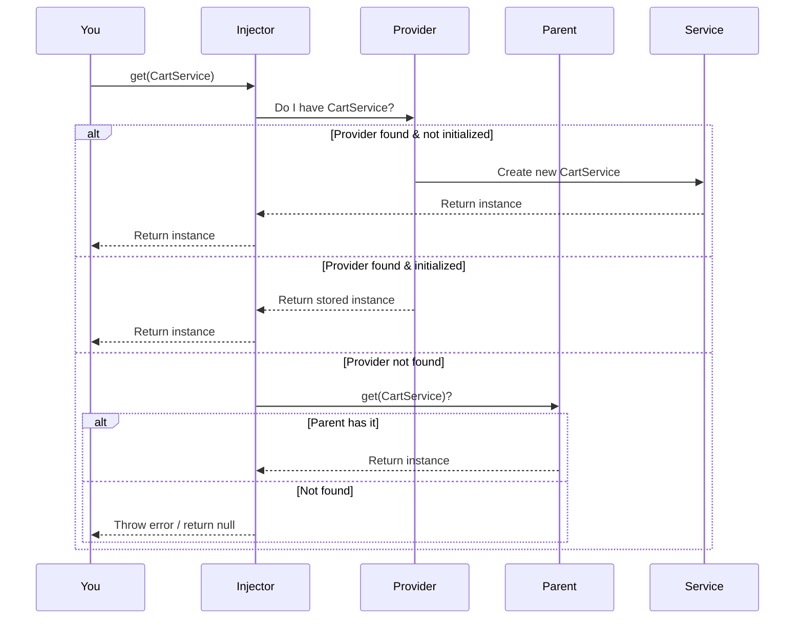

# Chapter 4: Injector

Welcome! In the last chapter, you learned how to use the [@Injectable Decorator](03__injectable_decorator_.md) to make classes available for dependency injection in your app.

Now it's time to meet the real *engine* behind how dependencies are handed out: **the Injector**!

---

## The Motivation: Who Hands Out My Stuff?

Let’s use a fun analogy.  
Imagine your app is like a busy restaurant kitchen.  
You have:

- **Recipes** (Providers): How to prepare or fetch things.
- **Ingredient names** (Tokens): Unique labels for what you want (see [InjectionToken](02_injectiontoken_.md)).
- **Chefs** (Services and Components): The people who need ingredients.

But who actually sits at the **center** handing out the right ingredients every time someone asks?  
**That’s the Injector!**

---

## Use Case: Getting Shared Ingredients (the CartService Example)

Let’s say several parts of your shop need a shared `CartService`.

**Scenario:**  
- You want all parts of your app to get **the same, ready-to-use CartService**—whether in the checkout, product list, or header.

You want to say:

```ts
const myCart = injector.get(CartService)
```

and always get the same shared instance—*no matter where you are in your code.*

---

## What is an Injector?

Think of the **Injector** as a:

- **Warehouse keeper** who knows all the recipes and what’s available.
- **Warehouse chain**: If the local store doesn't have something, it asks the “parent” warehouse!

In code, the *Injector* is a special helper you ask for things by name (or type), and it works behind the scenes to find or create what you need.

---

## Key Concepts of the Injector

Let's break it down into simple pieces:

### 1. **Storing Providers**
The Injector remembers all the recipes (providers) that you gave it when you set it up.

### 2. **Finding "Tokens"**
Whenever anyone asks for a certain dependency (by class, or [InjectionToken](02_injectiontoken_.md)), the Injector checks if it can provide it.

### 3. **Parent-Child Lookup**
If the Injector doesn’t have what you want, it can ask its parent (if it has one), like calling the main warehouse if the local store is empty.

### 4. **Create, Return, or Error**
- If it has the item already made, it returns it.
- If not, it will *create* the item using its recipe, remember it for the future, and then give it to you.
- If it can't find a recipe, it throws an error (or returns `null` if you ask nicely).

---

## Using the Injector: Step-by-Step

Let’s see how you would use the Injector in practice.

### 1. Set Up an Injector With Providers

```ts
import { Injector } from 'simple-ts-di';
import { CartService } from './cart.service';

const injector = new Injector(null, [
  { provide: CartService, useClass: CartService }
]);
```

**Explanation:**  
- We create a new Injector, with no parent (the first `null`), and pass it an array of provider "recipes".
- Now, the Injector *knows* how to create a `CartService`.

---

### 2. Ask the Injector for a Service

```ts
const cart1 = injector.get(CartService);
const cart2 = injector.get(CartService);
```

**What happens?**
- The *first* time you call `injector.get(CartService)`, it **creates** a new `CartService` and saves it.
- The *second* time you ask, it simply gives you the same one.  
  (`cart1 === cart2` is `true`!)

---

### 3. Handling "I Don't Have That!"

If you ask for something that wasn't registered:

```ts
injector.get(SomeMissingService); // throws Error: Dependency SomeMissingService is not registered
```

Unless you ask with the `{ optional: true }` option:

```ts
injector.get(SomeMissingService, { optional: true }); // returns null
```

---

### 4. Parent Injectors (Warehouses Chain!)

You can set up a main warehouse (“root injector”) and children:

```ts
const rootInjector = new Injector(null, [ /* root providers */ ]);
const childInjector = new Injector(rootInjector, [ /* more providers */ ]);
```

Now, if `childInjector` can't provide something, it will *ask* `rootInjector`!

---

## Diagram: How the Injector Works

Here's a simple illustration:



- If a child Injector can't provide what you want, it passes the request up the chain.
- Whoever can answer, does!

---

## Internal Walkthrough: What Happens on `.get()`?

Let's walk step by step:



---

## Implementation Peek: Under the Hood

Let’s look (in simple terms!) at what happens inside the `Injector` when you ask for a dependency.

**File:** `src/di/injector/injector.ts`

### The `get` Method

```ts
public get<T>(
  token: InjectionToken<T> | Constructor<T>,
  options = {},
): T | null {
  // 1. Try to find the provider for this token (class or token)
  let provider = this.providers.get(token.name);

  // 2. If not found, ask parent (unless self-only is requested)
  if (!provider && this.parent && !options.self) {
    return this.parent.get(token, options);
  }

  // 3. If optional and missing, return null
  if (!provider && options.optional) {
    return null;
  }

  // 4. Still not found? Throw an error!
  if (!provider) {
    throw new Error(`Dependency ${token.name} is not registered`);
  }

  // 5. If provider already has a value (singleton), return it.
  if ('value' in provider) {
    return provider.value;
  }
  
  // 6. Otherwise, create it (using the recipe), store, and return it.
  const dependency = this.initializeProvider(provider);
  this.providers.set(token.name, { value: dependency });
  return dependency;
}
```

**Explanation:**
- The method looks up the recipe (“provider”) for what you requested.
- If found, and already built, it gives you the existing instance.
- If not built, it creates it, remembers it, and gives it to you.
- If nothing is found, it tries the parent (if any).
- If it still can't find it, it throws or returns null.

---

### The `provide` Method

```ts
public provide<T>(provider: Provider<T>): void {
  this.providers.set(provider.provide.name, { provider });
}
```
**Explanation:**  
This just registers a new recipe in the Injector, so it knows what to provide next time.

---

## Analogy Time: The Helpful Warehouse

- The Injector is like a savvy warehouse manager.
- You say: “I need a carton of `CartService`.”
- The manager checks the warehouse. If it's already on the shelf, he grabs it.  
- If not, he follows your recipe to prepare one, labels it, and puts it on the shelf for next time.
- If he can't find or make one, he checks if the *bigger* (parent) warehouse has it.
- If nobody has it, he apologizes or shrugs (returns `null`)!

---

## Recap

You’ve learned:

- The **Injector** is the core object that knows how to find and create dependencies using recipes (providers).
- It’s a warehouse manager that serves up the right objects, creating them if needed.
- Injectors can be chained; if a local Injector doesn’t have what you need, it asks its parent.
- This system lets you *share* services, create new ones, and keep everything consistent and organized.

Ready to see how your app starts off with the central “warehouse”?  
Let’s meet the singleton that rules them all: [ROOT_INJECTOR](05_root_injector_.md)!

Continue your journey: [Chapter 5: ROOT_INJECTOR](05_root_injector_.md)

---

Generated by [AI Codebase Knowledge Builder](https://github.com/The-Pocket/Tutorial-Codebase-Knowledge)