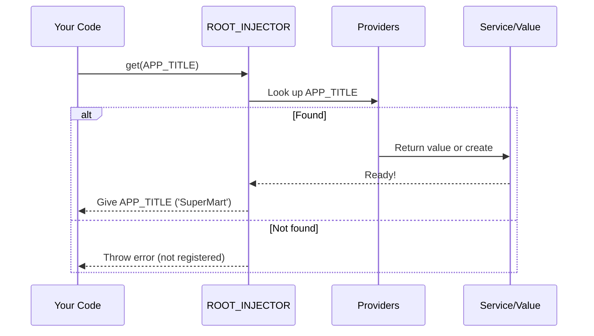

# Chapter 5: ROOT_INJECTOR

Welcome back! In the previous [Chapter 4: Injector](04_injector_.md), you learned how the **Injector** acts as the hardworking warehouse manager—handing out all your app's services, values, and dependencies.

But who runs the *main* warehouse? Where does everything ultimately come from, and how do you set up globally shared services for your entire app?

That's where the **ROOT_INJECTOR** steps in.

---

## Why Do We Need the ROOT_INJECTOR?

### The Central Use Case

Imagine you want to set a **global configuration** for your app—like the "store title"—so anywhere in your code, any component or service, can ask for it and get the same value.

Or maybe you have a `CartService` that every part of your app, from the header to the checkout page, should share.

You don’t want to set this up in every single place!  
You want a **central warehouse**, always available no matter where you ask.

> **Problem solved:** The `ROOT_INJECTOR` is your main, ever-present, singleton "warehouse" for global dependencies!

---

## What is the ROOT_INJECTOR?

- The **ROOT_INJECTOR** is the **global** instance of the [Injector](04_injector_.md).
- It's the "top boss" in the whole dependency hierarchy.
- Every other injector can ask the `ROOT_INJECTOR` for help if it can't provide something on its own.
- Any service or value provided here is available *everywhere* by default.

**Analogy:**  
It’s like the *master warehouse* in a city—every neighborhood store can call on it if they run out of supplies!

---

## Key Concepts

### 1. Singleton Pattern

There is only **one** ROOT_INJECTOR in your application.  
Whenever you import or use it, you always get the same shared instance.

### 2. Always Accessible

If you don’t create any custom injectors, the ROOT_INJECTOR is what’s used by default for resolving dependencies.

### 3. App-Wide Scope

Services registered with `ROOT_INJECTOR` are *singleton*: every part of your app gets the same instance or value.

---

## How to Use ROOT_INJECTOR

### Registering a Global Provider

Let’s make our app's title available everywhere:

```ts
import { InjectionToken, ROOT_INJECTOR } from 'simple-ts-di';

const APP_TITLE = new InjectionToken<string>('AppTitle');

ROOT_INJECTOR.provide({
  provide: APP_TITLE,
  useValue: 'SuperMart',
});
```

**Explanation:**  
- We create a token `APP_TITLE` to identify our config.
- We tell the ROOT_INJECTOR:  
  “Whenever someone asks for `APP_TITLE` anywhere, return `'SuperMart'`.”

---

### Using a Global Service Everywhere

Suppose you decorated your `CartService` with [`@Injectable({providedIn: 'root'})`](03__injectable_decorator_.md):

```ts
import { Injectable } from 'simple-ts-di';

@Injectable({ providedIn: 'root' })
export class CartService {
  /* ... */
}
```

Now, anywhere in your app, you can get the *singleton* CartService like so:

```ts
import { ROOT_INJECTOR } from 'simple-ts-di';
import { CartService } from './cart.service';

const cart = ROOT_INJECTOR.get(CartService);

cart.addItem('Banana');
```

**What happens?**  
- The first time, the ROOT_INJECTOR **creates** a `CartService` and saves it.
- Later, every request for `CartService` will get *the same instance*.

---

### Auto-registration: “providedIn: 'root'”

When you use `@Injectable({ providedIn: 'root' })` or `new InjectionToken({ providedIn: 'root' })`,  
the provider **automatically registers itself with the ROOT_INJECTOR**!

No code needed from you—just the decorator/option.

---

## Internal Implementation: What Actually Happens?

### Step-by-Step: How the ROOT_INJECTOR Handles Requests

Let’s walk through what happens when your app asks for something from the global registry.



- Your code asks ROOT_INJECTOR for a service or value.
- ROOT_INJECTOR checks its provider list for a matching token or class.
- If found, it returns (or creates) the instance.
- If not found, it throws an error.

---

### Under the Hood: How is ROOT_INJECTOR Defined?

Here’s how it’s set up inside the library:

**File:** `src/di/context.ts`
```ts
import { Injector } from './injector/injector'

// Create a single, shared Injector (singleton)
export const ROOT_INJECTOR = new Injector()
```
**Explanation:**  
- When the library starts up, it creates a single `ROOT_INJECTOR` that you can import anywhere.
- Every `.provide(...)` or `.get(...)` call just uses this *one* shared injector unless you set up a child.

---

### Registering and Using Providers with ROOT_INJECTOR

**Register a provider:**
```ts
ROOT_INJECTOR.provide({
  provide: APP_TITLE,
  useValue: 'SuperMart',
});
```
**Ask for a value:**
```ts
const title = ROOT_INJECTOR.get(APP_TITLE); // 'SuperMart'
```

---

### Advanced: Global Context Default

If no other injector is actively being used (for example, inside a component), code will default to using the ROOT_INJECTOR:

**File:** `src/di/context.ts`

```ts
export function getCurrentInjector(): Injector {
  return currentComponentInjector || ROOT_INJECTOR
}
```
**Explanation:**  
- If there’s no component-specific injector in use,  
  *all dependency lookups go straight to the ROOT_INJECTOR*.

---

## Analogy: The Big Warehouse in the City

- The ROOT_INJECTOR is like the mother of all warehouses.
- If you register a recipe here, **everyone** in your app can always get the same item.
- Even if smaller, local "stores" don't have what you need, the ROOT_INJECTOR will save the day.

---

## Recap

You learned:

- **ROOT_INJECTOR** is the master, always-present injector—your app’s main warehouse for dependencies.
- Registering a provider in ROOT_INJECTOR makes it globally available, to all parts of your app, anytime.
- `@Injectable({providedIn: 'root'})` and tokens with `providedIn: 'root'` auto-register themselves here.
- Unless you use a custom Injector, all `.get(...)` calls use ROOT_INJECTOR by default.

---

Now that you know how all your app's dependencies can be globally shared and managed, you’re ready to learn about building pieces of your UI!  
Get started with components in the next chapter: [@Component Decorator](06__component_decorator_.md)

---

Generated by [AI Codebase Knowledge Builder](https://github.com/The-Pocket/Tutorial-Codebase-Knowledge)