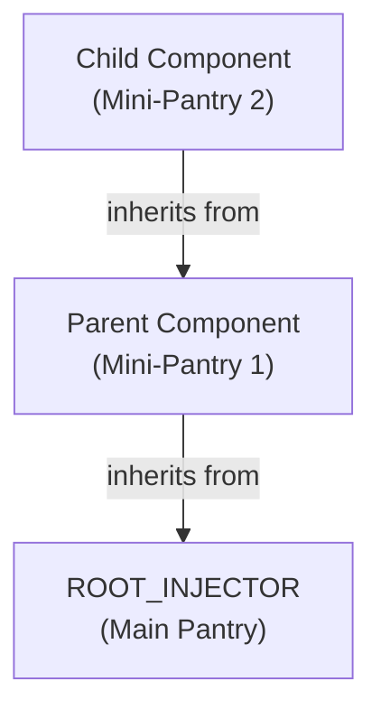
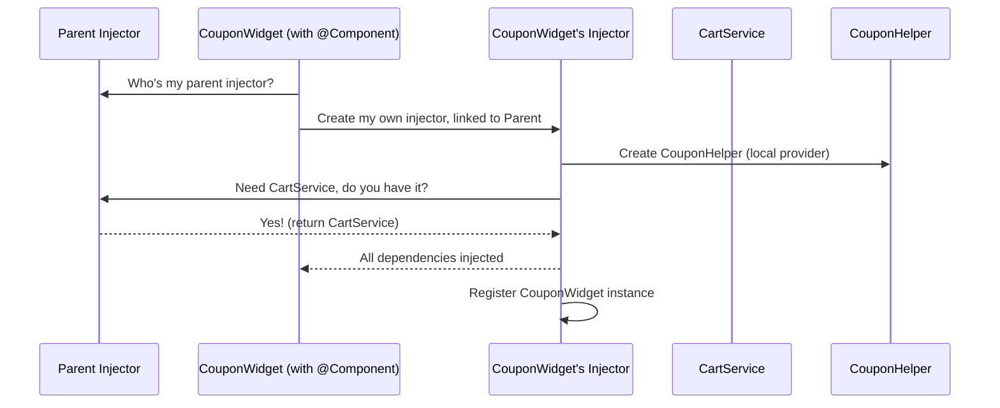

# Chapter 6: @Component Decorator

Welcome back! In the last chapter, you learned how the [ROOT_INJECTOR](05_root_injector_.md) is like your app’s main warehouse, handing out singleton services and configuration to every part of your app.

But how do you organize code into self-contained, independently functioning *parts*—like header bars, side menus, or pages—that need their own little "pantries" of ingredients, yet can still share things when needed? That’s where the **@Component Decorator** saves the day!

---

## Why Do We Need the `@Component` Decorator?

**Central use case:**  
Imagine you’re building a shopping cart page. You want the cart display, the coupon area, and the checkout button to each be their own component. Each should have:

- Access to shared services, like `CartService`
- (Optionally) Their own local configuration or helper classes, isolated from others

But! You don’t want everything globally shared or all jumbled together. Each component should have its own "mini-pantry"—but if the ingredient is missing locally, it should be able to fetch it from its parent pantry.

**In other words:**  
Components need their own **Injector**, filled with whatever "special ingredients" (providers) they ask for, but able to pull from the global or parent stores too.

---

## What Does the `@Component` Decorator Do?

The `@Component` decorator:

- **Wraps your component class**
- Gives it a brand-new **Injector** (its own mini-pantry!)
- Lets you specify *extra* providers (ingredients) for this component only
- Connects the "mini-pantry" to the parent Injector (so components can share, but also override, ingredients)
- Registers your component instance inside its own Injector, so you can also inject components if needed

---

## How Does It Work? (In Plain English)

Whenever you use `@Component`, it:

1. **Creates a special Injector** for your component, inheriting from the parent (the "current" injector context)
2. **Populates it** with any providers *you* specify
3. **"Runs" your component’s constructor** with this new Injector in effect (so all dependency lookups happen there)
4. **Registers your component** for injection inside its own Injector
5. **Restores the previous context** so everything continues smoothly

**Analogy:**  
Your component is like a chef who steps into their own fully-stocked workbench, but if they run out of something, they can shout to the main pantry or the next kitchen over.

---

## Key Concepts (with Diagrams!)

### 1. Every Component Gets Its Own Injector

Each time you use the `@Component` decorator, your component has a fresh Injector, linked to its parent.



- **New Injector:** Each component’s "pantry" is stocked from its parent by default.
- **Local Ingredients:** You can add special providers unique to just this component.

---

## Step-by-Step: How to Use `@Component`

Let’s build a practical example—a `CouponWidget` component that uses a shared `CartService`, but has its own local helper class!

### 1. Start with a Shared Service

(Already globally registered with `@Injectable({ providedIn: 'root' })`)

```ts
@Injectable({ providedIn: 'root' })
export class CartService {
  // Cart logic goes here...
}
```
*This is available everywhere via the [ROOT_INJECTOR](05_root_injector_.md).*

---

### 2. Create a Local Helper Class

```ts
export class CouponHelper {
  checkCoupon(code: string) {
    // For demo: Always true!
    return true;
  }
}
```
*This is NOT registered globally. We'll provide it only in our component.*

---

### 3. Define Your Component with `@Component`

```ts
import { Component } from 'simple-ts-di';

@Component([
  { provide: CouponHelper, useClass: CouponHelper }
])
export class CouponWidget {
  constructor(
    public cart: CartService,       // from parent injector or ROOT
    public helper: CouponHelper,    // from THIS component's injector
  ) {}
}
```

**What happens when you create a `CouponWidget`?**
- A brand new Injector is set up, inheriting from the parent (or ROOT).
- `CouponHelper` is only provided here—no other component sees it.
- `CartService` is resolved up the chain (if not overridden locally).

---

### 4. Create and Use Your Component

Let’s build and use `CouponWidget` in code:

```ts
const couponWidget = new CouponWidget();

// Use the dependencies!
couponWidget.cart.addItem('Socks');
const isValid = couponWidget.helper.checkCoupon('SAVEBIG');
```

**Expected behavior:**
- `cart` is shared app-wide (`CartService`, from ROOT or parent)
- `helper` is unique to this component (your own `CouponHelper` instance)

---

## Behind the Magic: How Does `@Component` Work Internally?

Let’s peek inside, step by step, using a diagram:



**Summary:**  
- The component gets its own injector, filled with local providers you specify, backed by the parent injector (which can be `ROOT_INJECTOR`).
- This injector serves dependencies to the component's constructor, from local first, then parent if missing.
- The component instance is itself registered in its injector for possible later lookups.

---

## Internal Implementation: Code Peek

Let’s walk through the (simplified) core logic of how the decorator is built inside `simple-ts-di`.

### The Decorator (High Level)

**File:** `src/di/decorators/component.ts`

```ts
export function Component(providers: Provider<any>[] = []) {
  return function <T extends Constructor>(target: T) {
    // ... magic is here ...
  }
}
```

The decorator wraps your class, changing its constructor logic!

---

### How the Injector is Setup

Inside the decorator, when you `new` up your component:

```ts
const parent = getCurrentInjector();       // 1. Find the parent (could be ROOT_INJECTOR)
const injector = new Injector(parent, providers); // 2. Setup a new injector for this component
setCurrentInjector(injector);             // 3. Make this component's injector "current"
super(...args);                           // 4. Run the original constructor, injecting dependencies
injector.provide({ provide: target, useValue: this }); // 5. Register component instance
injector.provide({ provide: COMPONENT, useValue: this });
setCurrentInjector(parent);               // 6. Restore parent context
```

**Explanation:**
- `getCurrentInjector()`: Gets the current "context" injector (parent).
- New `Injector(parent, providers)`: Makes a fresh injector for your component.
- Temporary context switch: Activates this injector while running the constructor.
- `super(...args)`: Calls your component's code, so `constructor(cart, helper)` gets the right dependency values.
- Registers: The component instance and a `COMPONENT` token for other uses.
- Restores the previous injector so nothing leaks.

---

### Complete Walkthrough (Summary)

So whenever you create a `@Component`:

1. A new injector is made, inheriting from the parent (could be [ROOT_INJECTOR](05_root_injector_.md))
2. Any specified providers become available *first* inside the component
3. When you ask for a dependency:
    - If it's provided locally, you get the local one
    - Otherwise, the request goes up to the parent (and eventually, ROOT_INJECTOR)
4. The component instance is registered in its own injector

---

## Analogy: Chefs and Pantries

- Every time you make a new chef (component), he gets his own workbench (mini-pantry).
- You can toss special tools/ingredients into his workbench.
- But if he needs sugar and doesn’t find it, he’ll check the main kitchen store.
- He can also “share” his workbench with helpers (child components) or keep things private!

---

## Recap & Transition

**You learned:**

- How the `@Component` decorator gives each component its own Injector ("mini-pantry")
- How to provide local dependencies for just that component
- How components share or isolate services using the injector chain
- What happens under the hood to make it all smooth and automatic

With these skills you can organize your app into clean, isolated pieces—each with exactly the services and helpers it needs, no more, no less.

---

Ready to see how your whole app starts up and connects everything together?  
Continue to [Chapter 7: Application Initialization](07_application_initialization_.md)!


---

Generated by [AI Codebase Knowledge Builder](https://github.com/The-Pocket/Tutorial-Codebase-Knowledge)