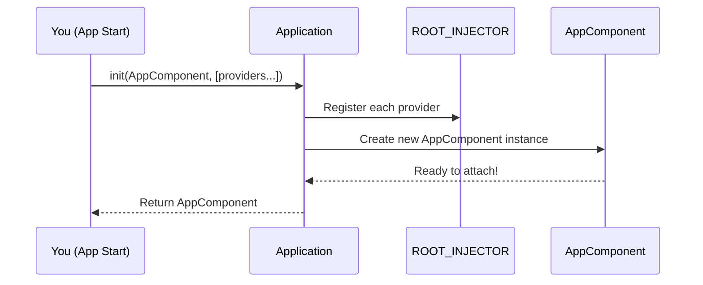

# Chapter 7: Application Initialization

Welcome! In [Chapter 6: @Component Decorator](06__component_decorator_.md), you discovered how components get their own "mini-pantry" of dependencies, but can also share from a global warehouse. But how does your app *actually start*? Who flips the "on" switch, sets up the global dependency system, and creates your app's root component so it can be shown on screen?

This is the job of **Application Initialization**.

---

## Why Do We Need Application Initialization?

**Central use case:**  
Imagine you want to launch your store app on a web page. You need to:

- Set up any global configuration, services, or theme for the entire app.
- Create your root component (like `AppComponent`) and set it up fully—so that its dependencies work, and it’s ready to attach to the DOM.
- Make sure the backbone of the whole dependency system is primed and ready *before* you even see your UI.

> **Problem solved:** Application Initialization is the simple "master switch" that turns on the whole app, wires up the central injector, and gets your main component ready to show.

---

## What Does Application Initialization Look Like (for Beginners)?

Let’s walk through the most common scenario: you want to start (bootstrap) your app.

### Example: The Simplest App Start-up

Suppose you have an `AppComponent` (your main UI entry point). To start your app, you only need a few lines:

```ts
import { Application } from 'simple-ts-di'
import { AppComponent } from './app/app'

const root = document.getElementById('app')

const app = Application.init(AppComponent)
root?.append(app.node)
```

**What happens here?**

- You tell the framework:  
  "Initialize my app with `AppComponent` as the main entry."
- The global dependency system comes online.
- An instance of `AppComponent` is created, with all its dependencies resolved.
- The resulting component instance is ready to be attached to the DOM (e.g., `app.node`).

---

## Key Concepts, Step-by-Step

Let's break down what's going on in a friendly, analogy-driven way.

### 1. "Flipping the Factory Switch" (Bootstrapping the System)

The `Application` acts like the big red ON button that powers up the DI (Dependency Injection) system and starts building your app.

### 2. Setting Up Global Providers (Optional)

If you need *extra* services for the whole app (besides those using decorators), you can hand in some special "recipes" (providers) when starting up the app:

```ts
const app = Application.init(AppComponent, [
  { provide: ThemeService, useClass: DarkThemeService },
  // More app-wide providers!
])
```
**Explanation:**  
- Any providers you pass here are registered globally before any components are created.

### 3. Creating Your Root Component

The initialization process creates your main app component (`AppComponent`), which in turn may create child components, and so forth.

---

## Solving the Use Case: Bootstrapping Your App

Let's put it all together—showing what you would code as a beginner to start your app.

### Complete Minimal Start-up Example

Suppose you want an app with a custom title and a shared `CartService`.

- `AppComponent` is your main component.
- You want to pass in a title using an [InjectionToken](02_injectiontoken_.md), and globally register it.

**Step 1: Define a Title Token**

```ts
import { InjectionToken } from 'simple-ts-di'
export const APP_TITLE = new InjectionToken('APP_TITLE')
```

**Step 2: Initialize the Application with Providers**

```ts
import { Application } from 'simple-ts-di'
import { AppComponent } from './app/app'
import { APP_TITLE } from './tokens'

// Add a value provider for your title!
const app = Application.init(AppComponent, [
  { provide: APP_TITLE, useValue: 'SuperMart' }
])
```

**Step 3: Attach the App to the Page**

```ts
const root = document.getElementById('app')
root?.append(app.node)
```

**What does this do?**
- Registers `'SuperMart'` as the value for `APP_TITLE` globally. Every component can inject this.
- Prepares your main UI component (with DI set up) and attaches it to the webpage!

---

## How It Works Under the Hood: Step-by-Step

Let’s peek *without code* at what happens when you call `Application.init(...)`.

### Sequence of Events



- You call `Application.init` with your root component and (optionally) providers.
- It first registers all your extra/global providers in the [ROOT_INJECTOR](05_root_injector_.md).
- Then it creates the main app component, resolving all its dependencies (using DI).
- The fully-wired component is handed back for you to attach to the page!

---

## Diving Deeper: Simple Code Walkthrough

Let’s look at how this is coded, using a small, easy-to-understand snippet.

**File:** `src/di/application/application.ts`

```ts
import { ROOT_INJECTOR } from '../context'

export class Application {
  static init(root, providers = []) {
    // 1. Register all provided global providers with ROOT_INJECTOR
    providers.forEach((provider) => ROOT_INJECTOR.provide(provider))
    // 2. Create your main AppComponent (root)
    return new root({})
  }
}
```

**Explanation:**
- The `init` method does two things:
  1. Registers all passed-in providers globally with the ROOT_INJECTOR (your app-wide warehouse).
  2. Creates a new instance of your root component (e.g., `AppComponent`), so dependencies work right from the start.
- That’s it! There’s no complicated setup or mysterious framework magic.

---

## Analogy Time: Starting a Factory

Think of `Application.init` as the "power up" lever:

- It *stocks* the main warehouse with the recipes/services you specify (like restocking before opening for business).
- Then it *hires* your first manager (`AppComponent`)—who, thanks to DI, starts with all needed equipment and helpers!

---

## Recap

Let’s review what you’ve learned:

- **Application Initialization** is a simple way to start your whole app.
- It sets up global providers (by registering them with the [ROOT_INJECTOR](05_root_injector_.md)), so every component and service can share the same configuration/services.
- It creates your main component with everything wired together, ready for display.
- You’re in control—just specify your root component and any extra app-wide providers.

---

Congratulations! Your app is now fully wired and ready to launch.  
Next, you'll learn how dependencies are actually *injected* into components and services when they're created, and how the injection context works in detail.

Continue your learning with: [Chapter 8: Inject/Injection Context](08_inject_injection_context_.md)

---

Generated by [AI Codebase Knowledge Builder](https://github.com/The-Pocket/Tutorial-Codebase-Knowledge)