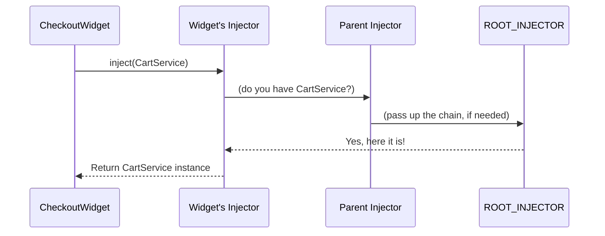

# Chapter 8: Inject/Injection Context

Welcome back! In [Chapter 7: Application Initialization](07_application_initialization_.md), you learned how your app first “wakes up”—wiring up the global dependency system and creating your main component, ready for action.

But when components and services are being created, **how do they actually get the stuff they ask for?**  
How is it possible to "just ask" for a `CartService` or a config token, and magically get the right thing—even from the right scope?

In this chapter, we'll unveil the **injection context** and the `inject` function—the dynamic duo that make "asking for what you need" simple, safe, and automatic.

---

## The Problem: How Do Classes Get Their Dependencies?

**Use Case:**  
You’re building a `CheckoutWidget` component. You want it to always use the *correct* `CartService`—maybe it’s the global one, or maybe an override from a parent component. BUT: you just want to *ask* for it, and trust the system to supply the right one, from the right place.

**What you want, as a developer:**

```ts
class CheckoutWidget {
  constructor() {
    this.cart = inject(CartService)
  }
}
```

- *No wiring, no lookups, no asking “which pantry do I look in?”*
- Just say what you need: **“inject me a CartService!”**

---

## Key Concepts: Injection Context & the `inject` Function

Let's break down how this works to keep things beginner friendly.

### 1. **The `inject()` Function**  
This is a magical little helper you call **inside constructors or functions** to ask for a dependency:

```ts
const cart = inject(CartService)
```

- It hands you whatever has been provided for that type or token.
- It finds the “right” source: your current component’s "mini-pantry," or its parent, or the global warehouse ([ROOT_INJECTOR](05_root_injector_.md)), **automatically**!

---

### 2. **The Injection Context**  
But… how does `inject()` know **which pantry (Injector) is in charge** when you call it?  
That’s where the **injection context** comes in.

- The **context** is like a "current location tag" in your app.
- When a component or service is being constructed, **the system temporarily marks its Injector as “current”**.
- Any call to `inject()` during component construction will go to the right pantry—in the right order!

#### **Analogy: The Right Pantry**

Imagine you’re a chef (component) standing in your own prep kitchen (injector).  
- If you need flour, you check your shelf.
- If you don’t have it, you shout to the main pantry.
- But you never accidentally grab from the wrong kitchen!

The **injection context** is what tracks which kitchen you’re in, so `inject()` never gets lost.

---

## How to Use `inject()` to Solve the Use Case

Let’s see how you’d actually use this in code.

### Example: Getting a Shared CartService in a Component

Suppose you want your `CheckoutWidget` to get a `CartService` (provided globally).

```ts
import { inject } from 'simple-ts-di'
import { CartService } from './cart.service'

export class CheckoutWidget {
  cart = inject(CartService)

  constructor() {
    // Now you can use this.cart everywhere in your component
  }
}
```

**What happens when this code runs?**

- While your component is being created, its injector is set as "current."
- Calling `inject(CartService)` asks the right injector for the dependency.
- You get the correct instance—maybe from your component’s injector, or higher up if not locally provided.
- No wiring, no guesswork, just the right value!

---

### Example: Getting a Config Value Using InjectionToken

```ts
import { inject } from 'simple-ts-di'
import { APP_TITLE } from './app-tokens' // an InjectionToken

export class HeaderComponent {
  title = inject(APP_TITLE)

  showTitle() {
    alert(this.title)
  }
}
```

- `APP_TITLE` might be provided at ROOT scope (see [InjectionToken](02_injectiontoken_.md)), so `inject(APP_TITLE)` works everywhere.
- The injection context ensures it always comes from the right place.

---

## Optional/Advanced: Optional & Self-only Injections

You can pass options to control injection, just like with `Injector.get()` ([see Chapter 4](04_injector_.md)).

```ts
const thing = inject(SomeToken, { optional: true }) // returns undefined if not registered
const onlyMyVersion = inject(MyService, { self: true }) // only look in current injector
```

---

## What Happens Under the Hood? (Step by Step)

Let’s watch what actually happens when `inject()` is called inside a component.



- `inject()` asks the current injector (context) for a dependency.
- If not found, the injector passes the request up the parent chain.
- The first provider found is used and returned.

---

## Dive Deeper: Implementation Walkthrough

### 1. **Keeping Track of the Current Injector**

**File:** `src/di/context.ts`

```ts
let currentComponentInjector: Injector | null = null

export function setCurrentInjector(injector: Injector): void {
  // Set the context before constructing a component
  currentComponentInjector = injector === ROOT_INJECTOR ? null : injector
}

export function getCurrentInjector(): Injector {
  // Return the "current" injector or ROOT if none is set
  return currentComponentInjector || ROOT_INJECTOR
}
```

**Explanation:**  
- Before a component or service is created, the DI system sets its injector as “current.”
- When that process finishes, it restores the previous context.
- `getCurrentInjector()` is what `inject()` uses to know **who's in charge** right now.

---

### 2. **How `inject()` Actually Looks Up Dependencies**

**File:** `src/di/inject.ts`

```ts
import { getCurrentInjector } from './context'

export function inject(target, options = {}) {
  const injector = getCurrentInjector()
  return injector.get(target, options)
}
```

**Explanation:**  
- When you call `inject(MyService)`, it asks the current context injector for that dependency.
- The injector uses its list of providers, then its parent, and so on (see [Injector](04_injector_.md)).
- You don’t need to know about the context—DI tracks it for you!

---

### 3. **The Big Picture: How Components Set Up Context**

Recall from [Chapter 6: @Component Decorator](06__component_decorator_.md):

```ts
// (simplified)
const parent = getCurrentInjector()
const injector = new Injector(parent, [ ...providers ])
setCurrentInjector(injector) // Mark as current
super(...args)               // Create the component, so inject() works
setCurrentInjector(parent)   // Restore parent context
```

- As soon as the component is being constructed, its injector is flagged as active.
- Any `inject()` calls inside are routed to the right place.

---

## Analogy: Always Grabbing Ingredients from the Right Place

- You (your class) just say, “Please get me Sugar.”
- The DI system makes sure you look on *your* shelf first, then your parent’s, then the big pantry—never in the wrong kitchen!

---

## Visual Recap

```mermaid
flowchart TD
    A[Component being created] -- setCurrentInjector --> B[Component's Injector]
    C[inject(CartService)] -- uses --> B
    B -- if not found --> D[Parent Injector]
    D -- if not found --> E[ROOT_INJECTOR]
    AnyFound -- returns --> A
```

---

## Conclusion & What's Next

**Summary:**

- The `inject()` function lets you grab dependencies on demand—no wiring, no manual lookup, just ask!
- The **injection context** keeps track of which Injector should answer requests, so you always get ingredients from the right pantry.
- This pattern is what makes dependency injection "just work" inside your component and service constructors.

Ready for more advanced magic? In the next chapter, you'll discover **Dynamic Component Creation**—how you can create new components (with their own fresh context!) *dynamically* at runtime.

Continue to [Chapter 9: Dynamic Component Creation](09_dynamic_component_creation_.md)


---

Generated by [AI Codebase Knowledge Builder](https://github.com/The-Pocket/Tutorial-Codebase-Knowledge)