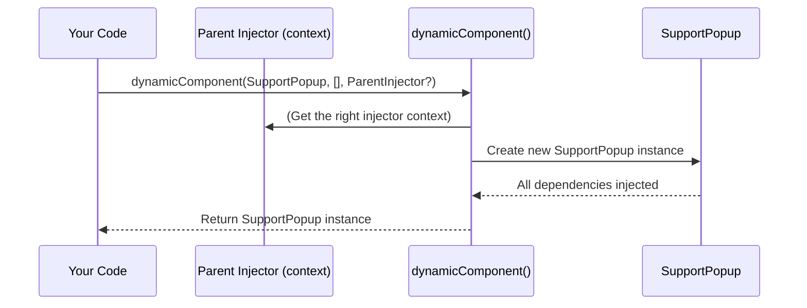

# Chapter 9: Dynamic Component Creation

Welcome back! In [Chapter 8: Inject/Injection Context](08_inject_injection_context_.md), you learned how dependency injection automatically gives your components and services what they need, from the right context.

But what if your app needs to **create components “on the fly”, at runtime**, not just at startup or as part of a static tree? Maybe you want to pop up a dialog, spawn a notification, or launch a widget in response to a user action, and you want those dynamic pieces to have all their dependencies wired up correctly.

That’s where **Dynamic Component Creation** comes in!

---

## Why Do We Need Dynamic Component Creation?

### Central Use Case

Imagine you’re building a shopping site.  
- The user clicks "Help," and you want to open a new `SupportPopup` component.  
- Or, a notification toaster pops up a `SaleBanner` component when a new deal arrives.

You **can’t know in advance** when (or even if) these components will be needed.  
But whenever you create them, you want each to:
- Get all their dependencies (services, configs, etc.) **from the current injector context** (parent, root, or local),
- Be “wired in” just like statically-created components.

**Problem solved:** Use the `dynamicComponent()` function!

---

## Key Concepts Behind Dynamic Component Creation

Let’s break down this abstraction into beginner-friendly ideas:

### 1. What Does `dynamicComponent()` Do?

When you call:

```ts
const instance = dynamicComponent(SupportPopup, [], injector)
```

- It **creates a new component “on demand”** (e.g., in response to user action),
- **Wires it up** with the correct dependency injection context—just as if it were created statically,
- Returns you a fully-constructed component instance, ready to display or use.

### 2. Why Can’t I Just Use `new`?

If you use plain `new`:
```ts
const popup = new SupportPopup()
```
- The component **doesn’t know** about the DI system!
- It won’t get correct dependencies, or it may break context-sensitive injections.

With `dynamicComponent()`, all the **injection magic** still works.

---

## Using `dynamicComponent()` – Step by Step

Let’s walk through a practical, real-world beginner use case.

### Example: Creating a Dynamic Support Popup

Suppose you want to show a `SupportPopup` only when the user clicks "Help".

#### 1. Define Your Components and Services

Services and tokens (e.g., `SupportService`, `APP_TITLE`) are registered as normal—see [Providers](01_provider_.md) or [InjectionToken](02_injectiontoken_.md).

```ts
export class SupportService {
  askQuestion(text: string) { /* ... */ }
}

@Component()
export class SupportPopup {
  support = inject(SupportService)
}
```

- Here, `SupportPopup` depends on `SupportService`.

#### 2. Create the Component Dynamically!

In your UI code (say, in an event handler):

```ts
import { dynamicComponent } from 'simple-ts-di'

function onHelpClick() {
  const popup = dynamicComponent(SupportPopup, [])
  // Add popup to the DOM, show it, etc.
}
```

**Beginner-friendly note:**  
- The second parameter is the constructor arguments for your component (empty array if none).
- If you leave out the third parameter, it grabs the **current injection context**—so, if you call this from inside another component, everything is still wired correctly!

---

## What Actually Happens When You Use `dynamicComponent()`

Let’s peek at how things work behind the scenes—without the complicated bits!

### Step-by-Step Flow



- **You call** `dynamicComponent()`, giving it the type of component you want.
- It figures out which injector/context to use (your current one, unless you override).
- It sets everything up **just like** the component was “born” in the normal lifecycle.
- **You get** a fully-wired component, same as if it had always been there!

---

## Diving Into the Code: How Does `dynamicComponent()` Work?

Let’s look at the critical code, kept nice and short.  
(**File:** `src/di/dynamic-component.ts`)

```ts
import { Injector } from './injector/injector'
import { assertRunInInjectionContext, setCurrentInjector } from './context'
import { inject } from './inject'

export function dynamicComponent(component, params, injector?) {
  if (!injector) {
    assertRunInInjectionContext(dynamicComponent)
    injector = inject(Injector)
  }

  setCurrentInjector(injector)

  return new component(params)
}
```

### Let’s break it down, line by line:

1. **Which injector do we use?**
   - If you supplied one, use it.
   - If not, grab the “current” context injector using [Chapter 8: Inject/Injection Context](08_inject_injection_context_.md).

2. **Wire context for the new component:**
   - `setCurrentInjector(injector)` marks this as the “active” context, so injecting dependencies goes to the right place.

3. **Finally, construct!**
   - `new component(params)` creates the component, just like you’d expect.
   - As it’s being created, any dependencies are injected from that context.

**That’s it—no other magic needed!**

---

## Why This Is Safe (and Powerful!)

- **No context mix-ups**: No matter where you create the component (from root app, nested widget, etc.), the new instance will pull dependencies from the right place.
- **Reusable logic**: You can create as many dynamic components as you want, when you need them, with all DI features intact.
- **Extensible**: You can pass in a different injector if you truly want a new isolated context (e.g., for a modal or sandbox).

---

## Analogy: Pop-up Chefs in the Right Kitchen

Imagine your restaurant:
- The main kitchen is always running, but sometimes, on demand, you need a pop-up chef (component) for a live event.
- With `dynamicComponent()`, your pop-up chef appears **already knowing** where the main pantry is, or even with a special private pantry if you wish.
- The chef can instantly use all the correct ingredients—no matter how or when he started work!

---

## Summary

- **Dynamic Component Creation** is the solution to "create components on demand, and wire them into DI like everything else".
- `dynamicComponent()` does the context and injector setup for you.
- You can create UI fragments, modals, or utility components at runtime—secure in the knowledge their dependencies are in the right place.
- It’s safe, easy, and fits naturally into the DI flow you’ve already learned.

Now you’re ready for even more advanced concepts—like **abstracting over constructor types for total flexibility!**

Continue your journey: [Chapter 10: Constructor Type Abstraction](10_constructor_type_abstraction_.md)


---

Generated by [AI Codebase Knowledge Builder](https://github.com/The-Pocket/Tutorial-Codebase-Knowledge)