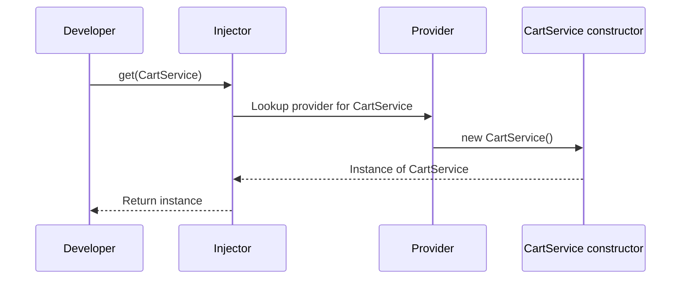

# Chapter 10: Constructor Type Abstraction

Welcome back! In [Chapter 9: Dynamic Component Creation](09_dynamic_component_creation_.md), you learned how to create components at runtime, while making sure they always receive the right dependencies from the current DI context.

In this chapter, we’ll meet a small but powerful TypeScript trick that makes all of this—and the whole injection system—possible: **Constructor Type Abstraction**.

---

## Motivation: Why Abstract Constructors?

Let’s start with a common use case:

You want your dependency system to support:

- Registering and retrieving services **by their class**
- Using **factories**, **tokens**, or even non-class “providers”
- Creating new instances dynamically, but only for things that can actually be *constructed* (i.e. called with `new`)

**But…**
TypeScript needs a way to know:  
*“Is this thing actually a class I can instantiate with `new`?”*

That’s where constructor type abstraction comes in!

---

## Use Case

**Suppose you want to:**

- Register a class with DI, so it can be created automatically.
- Support any class, not just ones following a special interface.

**For example:**

```ts
class CartService { /* ... */ }
injector.provide({ provide: CartService, useClass: CartService })
// Later:
const cart = injector.get(CartService)
```

You want to write type-safe code that “just works” with *any constructible class*, and inside DI, you want to be able to **abstract over "constructibleness"**.

---

## Key Concept: The `Constructor<T>` Type

### 1. What is `Constructor<T>`?

`Constructor<T>` is a *TypeScript* type that means:
> “A class that returns T when called with `new` and any arguments”

Here’s the actual type from the codebase:

```ts
// File: src/di/types/constructor.ts
export type Constructor<T extends any = any> = new (...args: any[]) => T
```

**Beginner explanation:**  
It represents *any* class with a constructor, like `CartService`, `PaymentGateway`, `UserComponent`, etc.

---

### 2. Why Do We Need Constructor Abstraction?

- **Flexibility:** Lets the DI system handle *any* class, no matter what the constructor looks like.
- **Safety:** TypeScript can check that you’re only trying to construct things that really are constructible!
- **Uniformity:** Now you can register, look up, or pass around “types” in your DI system, whether they’re classes or tokens, with consistent type safety.

---

### 3. Where Do We Use `Constructor<T>`?

You’ll see `Constructor<T>` used:

- When declaring providers:
  ```ts
  { provide: CartService, useClass: CartService }
  ```
  Both `provide` and `useClass` expect a `Constructor<T>`!

- When registering classes in [providers](01_provider_.md):

  ```ts
  // File: src/di/types/provider.ts
  export interface ClassProvider<T> {
    provide: InjectionToken<T> | Constructor<T>
    useClass: Constructor<T>
  }
  ```

- When asking for a dependency:
  ```ts
  const cart = injector.get(CartService) // CartService is a Constructor<T>
  ```

---

## How Does This Solve the Use Case?

### Example: Registering and Getting a Class Service

```ts
class CartService {
  // some logic
}

injector.provide({
  provide: CartService,
  useClass: CartService
})

// Later:
const cart = injector.get(CartService)
```

**What happens?**

1. The provider tells DI that `CartService` is the identifier and the constructor.
2. The DI system uses the `new` keyword to call the constructor for you:
   ```ts
   new provider.useClass()
   ```
3. You get a fully constructed instance. TypeScript makes sure this only works for real classes.

---

## Internals: What Actually Happens?

Let’s view a high-level walk-through of how DI uses constructors—abstractly!

### Step-by-Step Flow



- DI uses your class *as a value*—but only because it’s abstracted as a `Constructor<T>`.

---

## Code Dive: How Constructor Type is Used

Let's peek into a (simplified) snippet from the codebase.

### Defining the Type (for reference)

```ts
// src/di/types/constructor.ts
export type Constructor<T extends any = any> = new (...args: any[]) => T
```
**Explained:**  
You can accept any function/class that can be `new`ed to produce a `T`.

---

### Using Constructor Type in Providers

```ts
// src/di/types/provider.ts
export interface ClassProvider<T> {
  provide: InjectionToken<T> | Constructor<T>
  useClass: Constructor<T>
}
```
**Explained:**  
The provider expects a “constructible thing” for `useClass` (a class constructor), or a [token](02_injectiontoken_.md).

---

### Actually Constructing

Here's a simplified part of `Injector` that uses the constructor type:

```ts
if ('useClass' in provider) {
  return new provider.useClass()
}
```
**Beginner-friendly explanation:**  
The DI container can safely use `new` on whatever was provided, because it knows (thanks to the Constructor type) it’s always a class!

---

## Analogy: The Class Blueprint

- Imagine `Constructor<T>` as a *blueprint* you hand to a machine.
- The DI “factory” can build as many copies as needed—but only if the thing you handed over is an actual, valid blueprint.
- If you hand over, say, a brick (not a blueprint), the machine refuses to even try.

TypeScript’s Constructor abstraction ensures you can only use blueprints where building is intended.

---

## Visual Summary

```mermaid
flowchart TD
    A[Constructor<T> Type]
    B[CartService<br>(a class)]
    C[Injector]
    D[Instance: cart]
    
    A -- wraps --> B
    C -- uses new --> B
    B -- returns --> D
```

---

## Conclusion

In this chapter, you learned:

- Why a *constructor type abstraction* is essential for dependency injection: it lets DI build anything you register that’s “constructible”
- How the `Constructor<T>` type is defined and used to keep TypeScript and the DI system safe and general
- How this abstraction lets you register new class services, look them up, and always receive properly-constructed instances

**Well done!**  
You’ve now peeked behind the curtain and understand how DI in `simple-ts-di` can handle any constructible value—paving the way for advanced extension and flexibility.

---

Congrats on finishing the core concepts of `simple-ts-di`!  
Keep experimenting, and refer back to these chapters as you build your own apps. You're ready to use DI in TypeScript like a pro!

---

Generated by [AI Codebase Knowledge Builder](https://github.com/The-Pocket/Tutorial-Codebase-Knowledge)