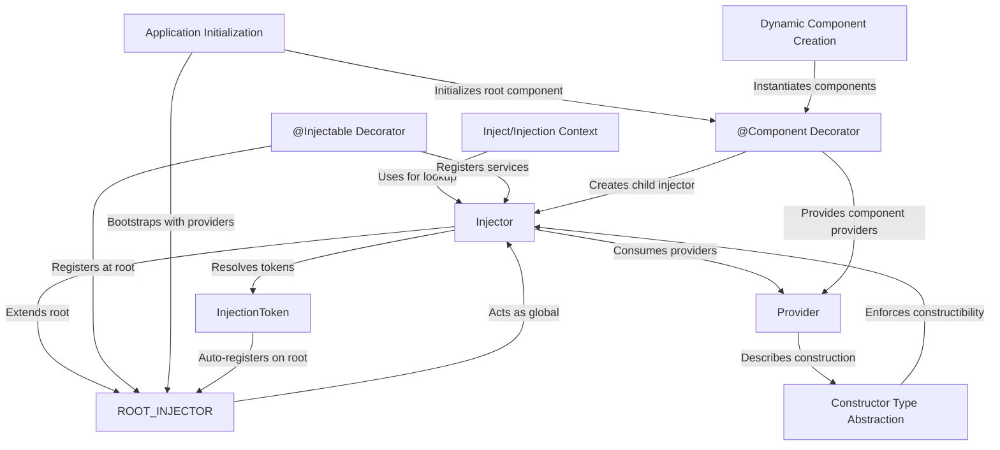

# Tutorial: simple-ts-di

**simple-ts-di** is a lightweight TypeScript dependency injection system designed to help you build modular and scalable applications. It provides an *Injector* that manages object creation and dependencies, *providers* that describe how to create or supply values, and *decorators* to make services and components available for injection. By using constructs like the *ROOT_INJECTOR*, *InjectionToken*, and dynamic component creation, it enables loose coupling, testability, and flexible application setup in a modern, beginner-friendly way.

**Source Repository:** [https://github.com/intelligentRaji/simple-ts-di.git](https://github.com/intelligentRaji/simple-ts-di.git)

## Chapters

1. [Provider
](01_provider_.md)
2. [InjectionToken
](02_injectiontoken_.md)
3. [@Injectable Decorator
](03__injectable_decorator_.md)
4. [Injector
](04_injector_.md)
5. [ROOT_INJECTOR
](05_root_injector_.md)
6. [@Component Decorator
](06__component_decorator_.md)
7. [Application Initialization
](07_application_initialization_.md)
8. [Inject/Injection Context
](08_inject_injection_context_.md)
9. [Dynamic Component Creation
](09_dynamic_component_creation_.md)
10. [Constructor Type Abstraction
](10_constructor_type_abstraction_.md)

---

Generated by [AI Codebase Knowledge Builder](https://github.com/The-Pocket/Tutorial-Codebase-Knowledge)